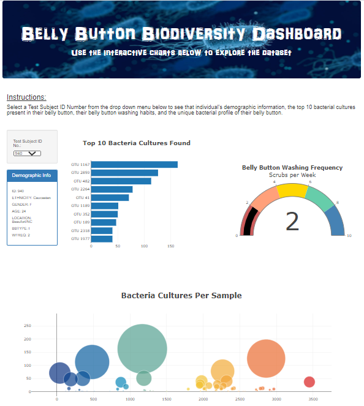

# Belly Button Biodiversity Dashboard

## Purpose

The purpose of this project was to make an interactive data visualization of bacterial cultures found in belly buttons. Users can select a test subject from a drop down menu and the dashboard will repopulate with data specific to that individual. See screenshot below.

Please visit [the dashboard](https://linzmacd.github.io/Biodiversity_Dashboard/) for more information and to look at some belly button bacteria data!

